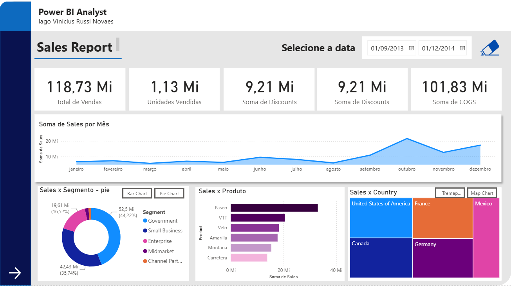

# 📊 Relatório Criativo — Sales Report (Power BI)

Dashboard de vendas construído no **Power BI**, utilizando um conjunto de dados financeiros de exemplo. O relatório apresenta indicadores de desempenho comercial (KPIs), evolução de vendas ao longo do ano e análises segmentadas por produto, segmento de mercado e país.

> ⚠️ **Observação:** este projeto foi desenvolvido **exclusivamente para fins educativos/estudo**, como prática de modelagem de dados e criação de dashboards no Power BI. Os dados utilizados são fictícios (dataset de amostra) e não representam informações reais de nenhuma empresa.

## 🖼️ Preview

## 📁 Estrutura do repositório

| Arquivo | Descrição |
|---|---|
| `relatrio_criativo.pbix` | Arquivo principal do Power BI com o modelo de dados, medidas DAX e as visualizações do relatório. |
| `Financial_Sample.xlsx` | Base de dados de exemplo (vendas, descontos, COGS, unidades, segmento, país, etc.) usada como fonte do relatório. |
| `clean_blue.png` | Ícone de "limpar filtros" (borracha) — versão azul, usada no tema claro do relatório. |
| `clean_white.png` | Ícone de "limpar filtros" (borracha) — versão branca, usada no tema escuro do relatório. |
| `print.png` | Imagem de preview/captura de tela do dashboard finalizado. |

## 📌 Conteúdo do dashboard

- **Cartões de KPI:** Total de Vendas, Unidades Vendidas, Soma de Descontos e Soma de COGS.
- **Gráfico de linha:** Soma de Vendas por Mês.
- **Gráfico de rosca (pizza):** Vendas por Segmento (Government, Small Business, Enterprise, Midmarket, Channel Partner).
- **Gráfico de barras:** Vendas por Produto (Paseo, VTT, Velo, Amarilla, Montana, Carretera).
- **Mapa de árvore (treemap) / Mapa:** Vendas por País (Estados Unidos, França, México, Canadá, Alemanha).
- **Filtro de data:** seletor de intervalo (data inicial e final).
- **Botão de limpar filtros:** ícone de borracha para resetar as seleções do relatório.

## 🛠️ Como usar

1. Instale o [Power BI Desktop](https://powerbi.microsoft.com/desktop/) (gratuito).
2. Baixe/clone este repositório.
3. Abra o arquivo `relatrio_criativo.pbix` no Power BI Desktop.
4. Caso o Power BI solicite a fonte de dados, aponte para o arquivo `Financial_Sample.xlsx` incluído no repositório.
5. Explore os filtros e visualizações interativas do relatório.

## 🎯 Objetivo do projeto

Este repositório tem propósito **didático**, servindo como material de estudo/portfólio para prática de:

- Modelagem de dados no Power BI;
- Criação de medidas e métricas de negócio;
- Design de dashboards e uso de imagens/ícones customizados;
- Storytelling de dados com gráficos interativos.

## 👤 Autor

**Iago Vinicius Russi Novaes**

---

*Projeto para fins de estudo e aprendizado em Power BI.*
